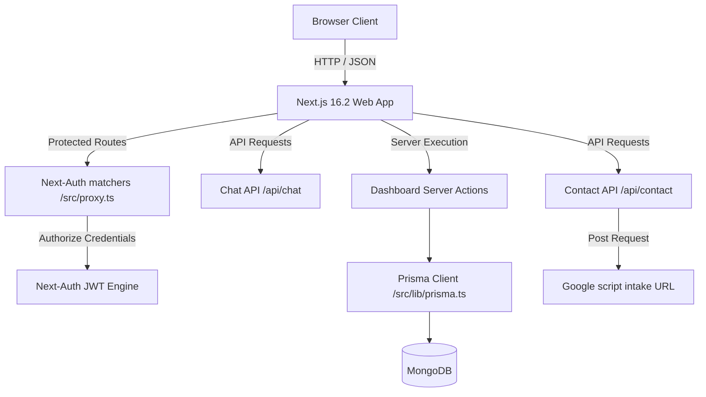
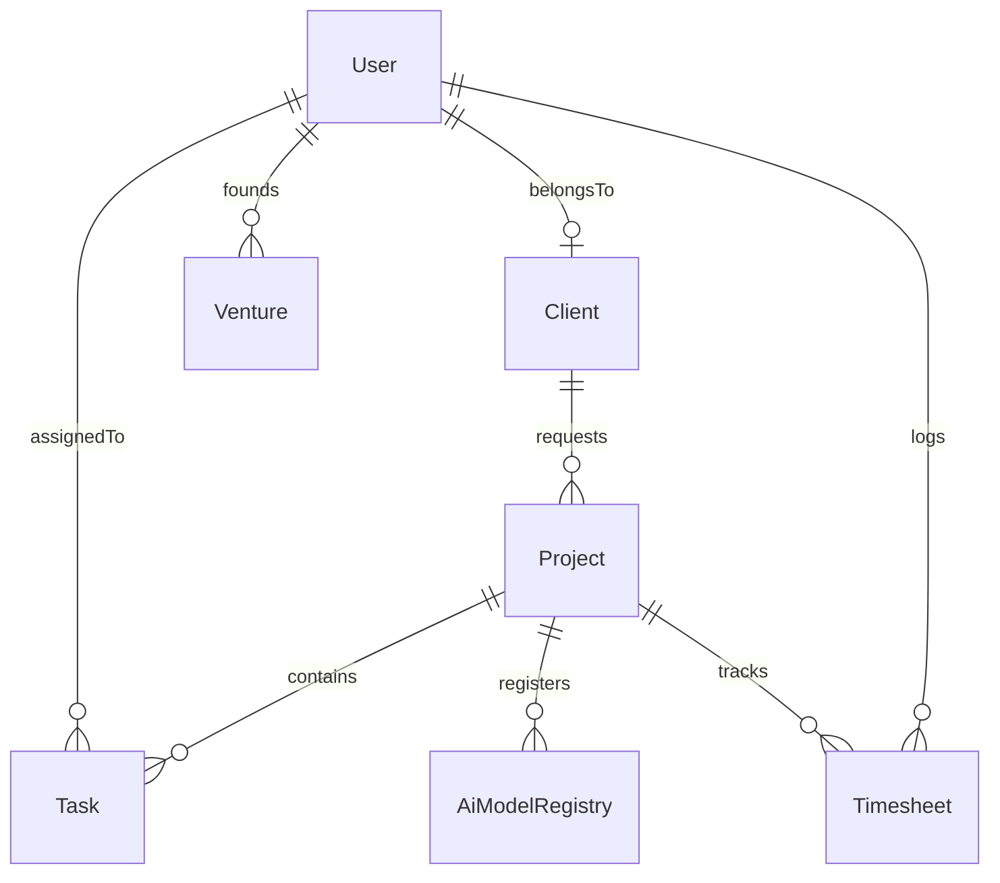

# Avora System Architecture & Project Onboarding Manual

This document provides a comprehensive breakdown of the Avora platform codebase. It maps the directory structures, data relations, components, dependencies, custom design rules, and improvements made during optimization cycles. It is designed to allow a new engineer to inherit and maintain the codebase with zero friction.

---

## System Architecture Map



---

## Codebase Directory Index

```
Avora/
├── prisma/                     # Database Engine configuration
│   └── schema.prisma           # Prisma MongoDB relational/document schema mapping
├── public/                     # Statically served graphic/image resources
│   ├── favicon.svg             # Custom Avora tab brand icon
│   └── *.jpg.jpeg              # Hero & Section premium structural mockups
├── src/
│   ├── actions/                # Next.js Server Actions (CRUD logic for client/venture entities)
│   ├── app/                    # Next.js App Router Page Layouts & API routes
│   │   ├── api/                # REST endpoints (chat, contact, reindex)
│   │   ├── dashboard/          # PM/Admin Venture Dashboard & Model Registry portals
│   │   │   ├── loading.tsx     # Animated Skeleton load templates
│   │   │   └── page.tsx        # Dashboard aggregation and KPI layout
│   │   ├── founder/            # Abhay Jain's biography portfolio layout
│   │   ├── layout.tsx          # Global Theme provider and top navigation configuration
│   │   └── globals.css         # Styling system base, utility, and glass-panel definitions
│   ├── components/             # Reusable UI component modules
│   │   ├── ui/                 # Small atomic elements (SpotlightNav, Logo)
│   │   ├── ChatbotWidget.tsx   # Floating AI conversation drawer component
│   │   ├── Services.tsx        # Service tabs selector sheet
│   │   └── Testimonials.tsx    # Operational verification carousel
│   ├── config/                 # Static metadata, site configurations
│   ├── hooks/                  # Custom React hooks (Intersection Observer)
│   └── lib/                    # Authentication configs, client hooks, environment validators
```

---

## Database Schema Details (Prisma + MongoDB)

The database layers are configured over **MongoDB** via the **Prisma ORM**.



### Core Entities:
* **User:** Handles admin, PM, developer, and client accounts. NextAuth checks against these records during authorization.
* **Client:** Companies partnering with Avora. Tracks tier, revenue, and active projects.
* **Project:** Core technical pipeline. Uses custom composite types for milestone timelines and integrated AI models.
* **AiModelRegistry:** Tracks deployed models, their framework type, inference latency, accuracy metrics, and unit costs.
* **Venture:** Studio entities. Contains Cap Table JSON files and private co-development market logs.

---

## Global Design Tokens & Theme Parameters

Avora uses **Tailwind v4** configuration integrated via PostCSS. The app has two primary color profiles, blending a luxury gold aesthetic with dark mode and warm alabaster light mode.

### Base Tokens (`/src/app/globals.css`):

| Variable | Light Mode (Root) | Dark Mode (`.dark`) | Purpose |
|---|---|---|---|
| `--background` | `#F8F5EE` (Cream Alabaster) | `#0a0a0f` (Graphite Black) | Main viewport backdrop |
| `--foreground` | `#3D2616` (Warm Chestnut) | `#f8fafc` (Slate Off-White) | Body text color |
| `--surface` | `rgba(255,255,255,0.75)` | `#121218` | Cards / Panel backgrounds |
| `--accent` | `#C5A059` (Rich Gold) | `#D4AF37` (Vibrant Gold) | Eyebrows, highlight states |

### Key Component Styles:
1. **Frosted Glass Panel (`.glass-panel`):**
   * *Light mode:* Gold-tinted translucent border (`rgba(212, 175, 55, 0.18)`), 92% solid cream backer.
   * *Dark mode:* Subtle graphite backer (`rgba(10, 10, 18, 0.88)`) with semi-transparent white borders.
2. **Primary Button (`.btn-primary`):**
   * Saturated gold base color `#D4AF37` with transition hover `#B8962D` and focus rings.

---

## Ponytail Cleanup
* **Deleted `Navbar.tsx`:** Standardized navigation directly on `SpotlightNav` wired in `layout.tsx` to remove a redundant file wrapper.
* **Deleted `PageTransition.tsx`:** Substituted the Framer Motion layout wrapper for a single high-performance hardware-accelerated CSS transition class (`animate-in fade-in slide-in-from-bottom-2`) directly on the `<main>` root layout tag.
* **Deleted `ui/TechnicalGrid.tsx`:** Inlined the dotted background layout directly into the single layout referencing it (`Contact.tsx`), saving file reads and loading times.

### Light/Dark Theme Switcher
* Implemented client-safe theme toggle buttons using `next-themes` and Lucide icons in both the desktop header and the mobile navigation drawer.
* Fixed contrast issues: Replaced all invalid utility color names (`text-slate-205`, `text-slate-750`) with valid tailwind colors to ensure 100% readability across both modes.

### Chatbot Cognitive Pipeline
* Removed unnecessary debug version texts (`v1.2.0-secure_node`) to declutter user interfaces.
* Removed bold formatting markdown asterisks (`**`) from responses to prevent rendering artifacts.
* Expanded route keyword match layers (costs, projects, founders, pricing tags) so users get exact information blocks instead of generic fallbacks.

### Skeleton Load Templates
* Created a layout loader (`src/app/dashboard/loading.tsx`) that renders 4 pulsing placeholder KPI cards and a mock data table while Next.js fetches server-side dynamic statistics from the database.
* Wrapped main children in a `<Suspense>` boundary inside `layout.tsx` to prevent Next.js static build export errors.
