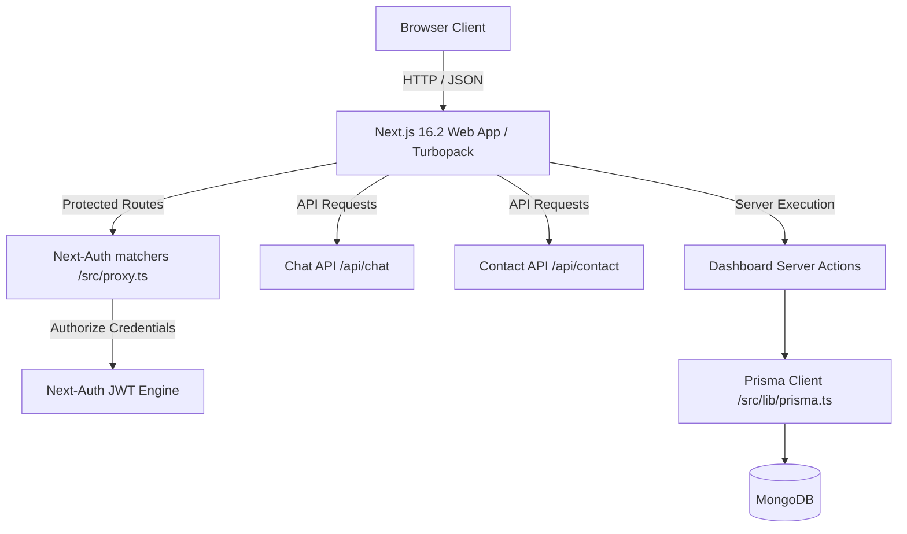
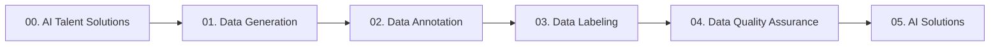
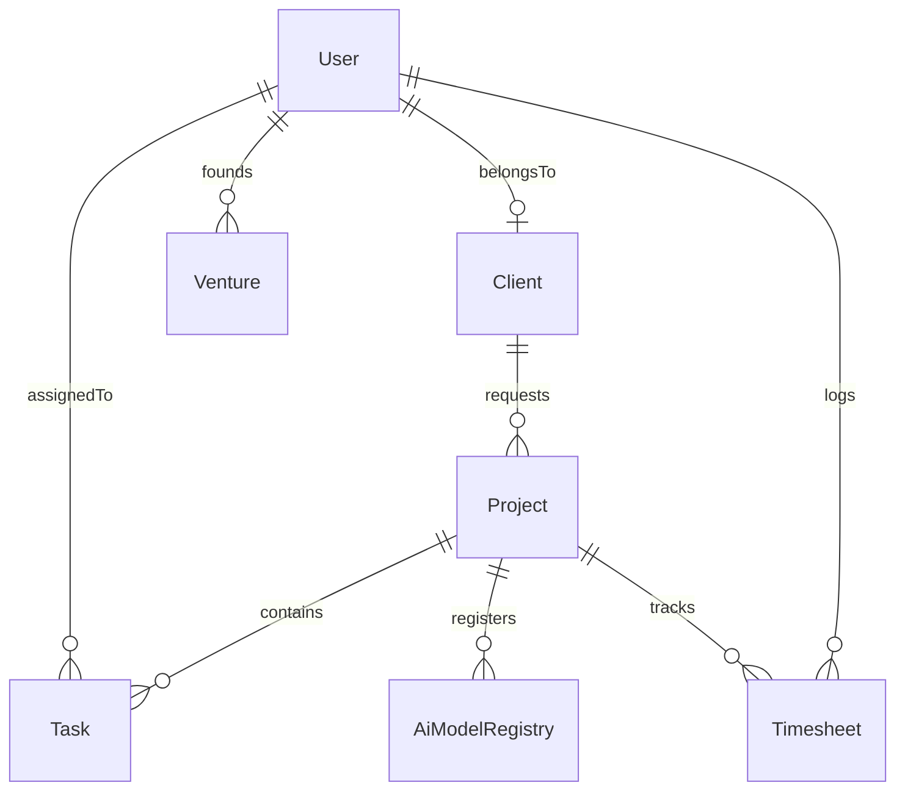

# Avora System Architecture & Development Manual

Welcome to the **Avora** platform codebase — an institutional-grade Next.js web application built for AI Infrastructure and Data Operations.

This manual documents the system architecture, directory structure, database schema, design system, 6-discipline service framework, and documentation index.

---

## 1. System Architecture Map


```mermaid
graph TD
    Client[Browser Client]
    NextJS[Next.js 16.2 Web App / Turbopack]
    Middleware[Next-Auth matchers /src/proxy.ts]
    Database[(MongoDB)]
    NextAuth[Next-Auth JWT Engine]
    PrismaClient[Prisma Client /src/lib/prisma.ts]
    
    %% API Gateways
    ChatAPI[Chat API /api/chat]
    ContactAPI[Contact API /api/contact]
    DashAPI[Dashboard Server Actions]

    Client -->|HTTP / JSON| NextJS
    NextJS -->|Protected Routes| Middleware
    Middleware -->|Authorize Credentials| NextAuth
    
    NextJS -->|API Requests| ChatAPI
    NextJS -->|API Requests| ContactAPI
    NextJS -->|Server Execution| DashAPI

    DashAPI --> PrismaClient
    PrismaClient --> Database
```

---

## 2. Six Disciplines Service Framework

Avora structures its core capabilities into **Six Disciplines**:


```mermaid
graph LR
    D0[00. AI Talent Solutions] --> D1[01. Data Generation]
    D1 --> D2[02. Data Annotation]
    D2 --> D3[03. Data Labeling]
    D3 --> D4[04. Data Quality Assurance]
    D4 --> D5[05. AI Solutions]
```

0. **AI Talent Solutions** — On-demand data scientists, ML engineers, and annotation leads embedded directly into client teams on a project or retainer basis.
1. **Data Generation** — Synthetic data generation, edge-case simulation, VAEs/GANs, and privacy-preserving augmentation.
2. **Data Annotation** — CVAT, bounding boxes, 3D point clouds, semantic segmentation, and domain ontology mapping.
3. **Data Labeling** — Text classification, NER, audio transcription, video event tagging, and OCR layout extractions (LayoutLMv3).
4. **Data Quality Assurance (DQA)** — Inter-annotator agreement tracking (Fleiss' $\kappa \ge 0.90$), multi-pass consensus validation, and 8-dimension quality profiling.
5. **AI Solutions** — Custom model development, fine-tuning, RAG pipelines, predictive analytics ensembles, and SHAP explainability.

---

## 3. Codebase Directory Structure

```
Avora/
├── docs/                               # System Documentation & Strategy Deliverables
│   ├── blueprints/                     # Architectural specifications & technical blueprints
│   ├── marketing/                      # 7 Marketing Strategy & Client Acquisition Deliverables
│   │   ├── 01_competitor_analysis.md   # Scale AI, Labelbox, Appen competitive matrix
│   │   ├── 02_seo_strategy.md          # 5-Discipline Keyword Clusters & Roadmap
│   │   ├── 03_content_engine_playbook.md
│   │   ├── 04_7day_client_acquisition_playbook.md
│   │   ├── 05_outbound_email_and_linkedin_pitch_templates.md
│   │   ├── 06_avora_vs_competitors_landing_page.md
│   │   └── 07_enterprise_email_pitch_package.md
│   └── reports/                        # Audit reports, presentations, and technical decks
├── prisma/                             # Database engine schema (MongoDB)
│   └── schema.prisma
├── public/                             # Static public web assets
│   ├── images/                         # Categorized visual assets & preview mocks
│   └── logos/                          # Enterprise partner SVG logos
├── src/                                # Application Source Code
│   ├── actions/                        # Next.js Server Actions (CRUD logic)
│   ├── app/                            # App Router Pages (Home, Services, Work, Dashboard, API)
│   ├── components/                     # UI Components (SpotlightNav, ShaderBackground, Hero)
│   ├── config/                         # Static metadata & site configuration
│   ├── hooks/                          # Custom React hooks
│   └── lib/                            # Prisma client, auth, and environment utilities
├── .gitignore                          # Excludes .env, .next, .vercel, local agent data
├── next.config.ts                      # Next.js build configuration
├── package.json                        # Dependencies and script definitions
├── tailwind.config.ts                  # Tailwind styling configuration
└── tsconfig.json                       # TypeScript compiler settings
```

---

## 4. Database Schema Details (Prisma + MongoDB)

The database layer operates over **MongoDB** via **Prisma ORM**.


```mermaid
erDiagram
    User ||--o| Client : belongsTo
    User ||--o{ Venture : founds
    User ||--o{ Task : assignedTo
    Client ||--o{ Project : requests
    Project ||--o{ Task : contains
    Project ||--o{ AiModelRegistry : registers
    Project ||--o{ Timesheet : tracks
    User ||--o{ Timesheet : logs
```

### Core Entities:
* **User:** Admin, PM, developer, and client accounts with NextAuth authorization.
* **Client:** Partner enterprise accounts tracking tier, revenue, and active projects.
* **Project:** Core technical pipeline with composite milestone timelines.
* **AiModelRegistry:** Deployed AI models, latency benchmarks, accuracy metrics, and unit costs.
* **Venture:** Studio entities with Cap Table tracking and co-development logs.

---

## 5. Design System & Global Tokens

Avora utilizes **Tailwind CSS v4** with a luxury gold aesthetic blending a dark mode profile and alabaster light mode.

| Variable | Light Mode | Dark Mode (`.dark`) | Purpose |
|---|---|---|---|
| `--background` | `#F8F5EE` (Cream Alabaster) | `#0a0a0f` (Graphite Black) | Viewport background |
| `--foreground` | `#3D2616` (Warm Chestnut) | `#f8fafc` (Slate Off-White) | Typography color |
| `--surface` | `rgba(255,255,255,0.75)` | `#121218` | Cards & glass panels |
| `--accent` | `#C5A059` (Rich Gold) | `#D4AF37` (Vibrant Gold) | Highlights & accents |

---

## 6. Getting Started & Development Commands

### **Prerequisites**
- Node.js 18+
- npm or yarn
- MongoDB database connection string (`DATABASE_URL`)

### **Commands**

```bash
# 1. Install dependencies
npm install

# 2. Generate Prisma Client
npx prisma generate

# 3. Run development server (Turbopack)
npm run dev

# 4. Create production build
npm run build

# 5. Start production server
npm start
```
