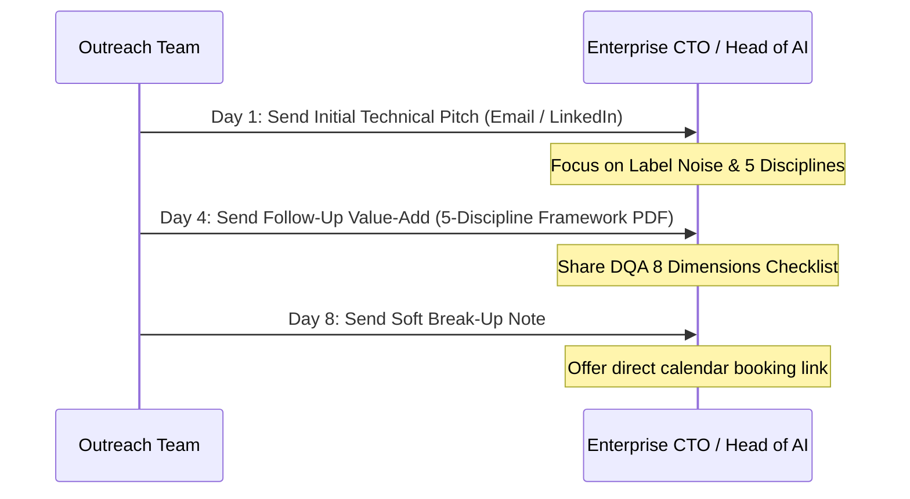

# Enterprise Email Outreach Pitch Package — Avora Ventures

**Brand:** Avora Ventures (`avora-ventures`)  
**Positioning:** Institutional AI Infrastructure & Data Operations  
**Core Framework:** The Five Disciplines Framework  
**Target Personas:** Chief Technology Officers (CTOs), VPs of AI/ML, Heads of Data Engineering, VPs of Data Science  
**Source Baseline:** Verified directly against Avora Codebase (`src/app/services/ServicesPage.tsx`) & AI Delivery Playbook  

---

## Executive Pitch Strategy

Most outbound B2B emails fail because they offer generic "data labeling services" or "AI software tools."  
This pitch package targets the **4 core operational bottlenecks** enterprise ML leaders experience:
1. **Data Scarcity & Privacy Constraints** (Solved by *Data Generation*)
2. **Label Noise & Inter-Annotator Bias** (Solved by *Data Quality Assurance & Fleiss' Kappa $\ge 0.91$*)
3. **Complex Document / Multimodal Extractions** (Solved by *Layout & Multi-Pass Labeling*)
4. **Black-Box Model Resistance** (Solved by *AI Solutions with SHAP Explainability*)

---

## Pitch Option 1: The "Label Noise & F1-Score" Pitch (CTO / Head of ML Focus)

*Best for:* Companies actively running computer vision, NLP, or predictive ML models in production.

```
Subject: Fixing label noise in [Company Name]'s training pipeline

Hi [First Name],

When an enterprise ML model plateaus in production, the standard playbook is to swap model architectures or re-tune hyperparameters. 

However, empirical data shows that a 10% reduction in label noise yields a 15–25% boost in F1-score — far outperforming architecture tweaks.

At Avora Ventures, we engineer institutional-grade data infrastructure across Five Disciplines:
1. Data Generation — Synthetic VAE/GAN augmentation for rare events & privacy-preserving datasets
2. Data Annotation — CVAT, bounding box, 3D point cloud, and semantic segmentation with Fleiss' Kappa ≥ 0.91 targets
3. Data Labeling — OCR layout extraction (LayoutLMv3) & multi-pass consensus protocols
4. Data Quality Assurance — Profiling & remediation across 8 core dimensions (Accuracy, Consistency, Timeliness)
5. AI Solutions — Custom predictive ensembles with built-in SHAP explainability layers

If [Company Name] is experiencing label variance or data scarcity in your current training pipeline, we’d be glad to share our 8-dimension DQA benchmark framework.

Are you available for a brief 10-minute introductory call this Thursday at 2:00 PM EST?

Best regards,

[Your Name]
Avora Ventures | Institutional AI Infrastructure
[Website Link]
```

---

## Pitch Option 2: The "Rare Events & Synthetic Data" Pitch (Healthcare / AgTech / Industrial Focus)

*Best for:* Sectors blocked by data scarcity, extreme edge cases, or strict privacy regulations (HIPAA, GDPR).

```
Subject: Overcoming data scarcity in [Company Name]'s ML pipeline

Hi [First Name],

Many specialized AI teams face a fundamental bottleneck: real-world data collection for rare events (equipment failure, rare anomalies, crop stress, clinical edge cases) takes years to aggregate.

Rather than waiting years for natural collection, Avora Ventures engineers physics-informed synthetic data pipelines (using VAEs, GANs, and agent-based simulations) paired with differential privacy budgets.

Our Five-Discipline Framework covers the full lifecycle:
• Synthetic Data Generation (simulating rare edge cases with zero real PII)
• Domain Ontology Annotation (multi-spectral, CV, and NLP)
• 8-Dimension Data Quality Assurance (profiling, root-cause defect prevention, continuous monitoring)

Would you be open to a 10-minute technical exchange next week to see how synthetic generation handles [Company Name]'s rare edge-case scenarios?

Best regards,

[Your Name]
Avora Ventures | Institutional AI Infrastructure
[Website Link]
```

---

## Pitch Option 3: The "Unstructured Document & Clinical Extraction" Pitch (Pharma / Finance / Legal)

*Best for:* Enterprise organizations handling complex documents, consent forms, lab results, and legal contracts.

```
Subject: Manual extraction bottlenecks in [Company Name]'s document pipeline?

Hi [First Name],

Manual review of complex documents — consent forms, physician notes, adverse event reports, and financial contracts — remains slow, expensive, and prone to compliance risk.

At Avora Ventures, we deploy operationalized OCR layout analysis (LayoutLMv3) combined with expert multi-pass consensus verification protocols to extract structured intelligence from millions of unstructured pages with zero post-delivery re-extractions required.

We handle the full pipeline under our Five Disciplines Framework:
• Data Labeling & Document Extractions (47+ data point categories)
• Consensus Verification Protocols (triple-review on ambiguous regions)
• Statistical QA Gates (F1 and Cohen's Kappa sign-off prior to delivery)

Are you open to a brief 10-minute call to discuss [Company Name]'s current document processing throughput?

Best regards,

[Your Name]
Avora Ventures | Institutional AI Infrastructure
[Website Link]
```

---

## 3-Touch Outreach Schedule & Follow-Up Blueprint



### **Follow-Up Touch 2 (Day 4 Value-Add Script):**
```
Subject: Re: Data quality & pipeline infrastructure for [Company Name]

Hi [First Name],

Following up on my note regarding [Company Name]'s data pipeline. 

I thought you might find our 8-Dimension Data Quality Assurance Checklist helpful as your team evaluates model performance for Q3/Q4:
• Accuracy & Completeness (eliminating missing history)
• Consistency & Timeliness (preventing stale system inputs)
• Validity, Uniqueness, Relevance & Accessibility

If you'd like to benchmark your current dataset against these 8 dimensions, I'm happy to walk through our methodology.

Do you have 10 minutes open on Friday morning?

Best,
[Your Name]
```

### **Follow-Up Touch 3 (Day 8 Gentle Break-Up Script):**
```
Subject: Final thought on [Company Name]'s AI data pipeline

Hi [First Name],

I'm assuming data pipeline optimization or synthetic data generation isn't a top priority for [Company Name] at the moment.

I'll pause outreach for now, but if label noise or data scarcity becomes a bottleneck down the road, feel free to book time directly on my calendar: [Calendar Link].

Best regards,

[Your Name]
Avora Ventures
```
